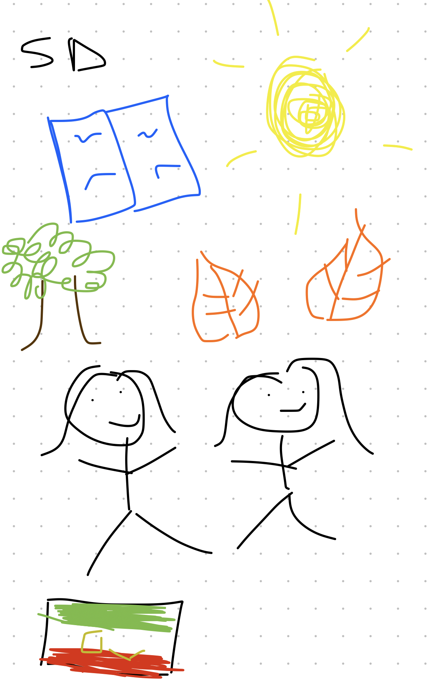

# **Nikki's Blog** 

### Fun Facts
- I have a twin sister.
- I'm Persian.
- I love salads--literally any type of salad.

### Career Goals
I have a great passion for social justice and creative writing, so I hope to pursue law and authorship. I'm thrilled to be publishing a young adult fantasy novel before I graduate high school. With all that being said, computer science has always interested me and I'd love to have some coding skills up my arsenal. 

### A Drawing About Me

### Overview of Hacks, Study and Tangibles
Blogging in GitHub pages is a way to learn and code at the same time. 

- Plans, Lists, [Scrum Boards](https://clickup.com/blog/scrum-board/) help you to track key events, show progress and record time.  Effort is a big part of your class grade.  Show plans and time spent!
- [Hacks(Todo)](https://levelup.gitconnected.com/six-ultimate-daily-hacks-for-every-programmer-60f5f10feae) enable you to stay in focus with key requirements of the class.  Each Hack will produce Tangibles.
- Tangibles or [Tangible Artifacts](https://en.wikipedia.org/wiki/Artifact_(software_development)) are things you accumulate as a learner and coder. 
